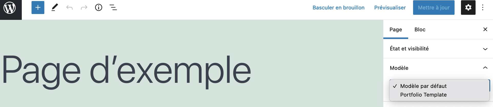
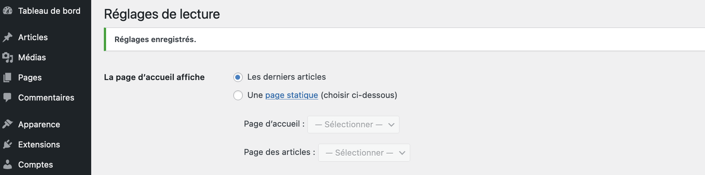

# Page et articles

* 🔖 **Modèles de page**
* 🔖 **Types de page**
* 🔖 **Page statique**

___

## 📑 Modèles de page

> Les modèles de page sont un type spécifique de fichier modèle qui peut être appliqué à une page spécifique ou à des groupes de pages.


Les modèles de page sont utilisés pour modifier l'apparence d'une page.

* Un modèle de page peut être appliqué à une seule page, une section de page ou une classe de pages.
* Les modèles de page ont généralement un niveau élevé de spécificité, ciblant une page individuelle ou un groupe de pages. Par exemple, un modèle de page nommé page-about.php est plus spécifique que les fichiers de modèle page.php ou index.php car il n'affectera qu'une page avec le slug « about ».
* Si un modèle de page a un nom de modèle, les utilisateurs de WordPress qui modifient la page ont le contrôle sur le modèle qui sera utilisé pour afficher la page.

[Page template](https://developer.wordpress.org/themes/template-files-section/page-template-files/)

### 🏷️ **Déclaration**

Il faut créer un fichier qui ne pose pas de probème avec le nommage utilisé par wordpress et sa hierarchie, en utilisant des _ à la place des - par exemple.

* template_portfolio.php

Le fichier doit comporter un commentaire permettant à wordpress de le détecter comme modèle de page.

```php
<?php 

/* Template Name: Portfolio Template */

?>
```

### 🏷️ **Affichage**

Suite à cette déclaration nous pouvez observer sur lors de l'édition d'une page que nous pouvons selectionner un modèle spécifique, celui créé précédement.



Il reste alors à utiliser les différentes fonctions de wordpress pour construire la page.

___

👨🏻‍💻 Manipulation

Créez un modèle de page à appliquer sur une page au choix et reconstituez son contenu.

___

## 📑 Types de page

Par défaut, un modèle de page personnalisé sera disponible pour le type de publication « page ».

### 🏷️ **Déclaration**

Pour créer un modèle de page pour des types de publication spécifiques, ajoutez une ligne sous le nom du modèle avec les types de publication que vous souhaitez que le modèle prenne en charge.

```php
<?php
/*
Template Name: Portfolio Template
Template Post Type: post, page, event
*/
?>
```

### 🏷️ **Affichage**

Si vous créez un type de post spécifique vous pouvez les ajouter dans la liste des types ou le template est applicable.

___

## 📑 Page statique

Il est possible de choisir pour la page d'accueil une page statique.


Par défaut, WordPress affiche une liste de publications sur la page d'accueil de votre site. Cette liste d'articles est automatiquement mise à jour dès que de nouveaux articles sont publiés, ce n'est donc pas statique. De plus, il n'est pas nécessaire de créer de page pour que WordPress affiche cette liste de publications.

### 🏷️ **Déclaration**

> Une page d'accueil statique est une page spécifique utilisée comme page d'accueil du site.



Vous pouvez choisir une page ou un article et allez actionner le fichier `page.php` ou `archive.php`.

Vous pouvez tout de même avoir un fichier spécifique pour la page d'accueil en créant le fichier `home.php` ou `front-page.php`. Si vous créez le fichier `front-page.php`, il sera utilisé si ce réglage est activé quelque soit le choix précédent.

[Front Page](https://bom.ciens.ucv.ve/dataset/data/20140924151121/#Creating_a_Static_Front_Page)
