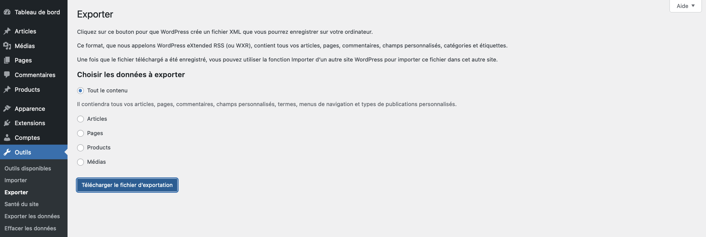

# Migration

* 🔖 **Local**
* 🔖 **Distant**

___

## 📑 Local

Vous travaillez en local pour conserver l'intégrité et le bon fonctionnement de votre site pour vos utilisateurs. Maintenant il est temps de rendre visible votre travail.

### 🏷️ **Database**

> La première étape consiste à exporter votre database.

#### **Export**

Si c'est la première mmigration je vous conseil de faire un export en ligne de commande ou avec l'outil de votre choix.

```bash
mysqldump -u root my_db_name > my_db_name.sql
```

Si vous avez un mot de passe pour vous connecter à votre serveur de base de données.

```bash
mysqldump -u root -p my_db_name > my_db_name.sql
```

Nous pouvons maintenant l'importer chez l'hébergeur.

#### **Import**

Chez un hébergeur, créez une base de données et souvenez vous des info suivantes:
* Nom de la base de données
* Nom d'utilisateur
* Mot de passe
* Host

Vous n'avez plus qu'à importer le fichier généré précédement.

Dernière étape de la database, modifier les URLs. Il vous faut effectuer une opération manuelle de modification ou exécuter du SQL permettant de modifier le contenu de vos tables.

La série de requête suivante doit être personnalsiée et exécutée dans l'onglet SQL de votre hébergeur.

```sql
# Site
UPDATE wp_options
SET option_value = replace(option_value, 'http://localhost:8000', 'http://www.nouveau-site.com')
WHERE option_name = 'home'
OR option_name = 'siteurl';

# GUID
UPDATE wp_posts
SET guid = REPLACE (guid, 'http://localhost:8000', 'http://www.nouveau-site.fr');

# Articles et pages
UPDATE wp_posts
SET post_content = REPLACE (post_content, 'http://localhost:8000', 'http://www.nouveau-site.fr');

# Données meta
UPDATE wp_postmeta
SET meta_value = REPLACE (meta_value, 'http://localhost:8000','http://www.nouveau-site.com');
```

Tout ceci concernait la première fois que vous migirez votre projet. Pour les prochaines fois vous pourez utiliser l'outil d'import/export de wordpress concernant vos données.




### 🏷️ **Files**

> Nous allons passer à l'export de nos fichiers.

#### **Export**

* Faites une copie de votre projet.

Nous allons modifier le fichier` wp-config.php` du projet copié pour qu'il corresponde aux attendus de notre server distant. Faites correspondre les informations de connection à la base de données créée précédement.

```php
define( 'DB_NAME', 'my_db_name' );

/** MySQL database username */
define( 'DB_USER', 'root' );

/** MySQL database password */
define( 'DB_PASSWORD', '' );

/** MySQL hostname */
define( 'DB_HOST', '127.0.0.1' );
```

Pensez également à ne pas être en mode `DEGUB` afin de ne pas afficher les messages d'erreur.

```php
define( 'WP_DEBUG', false );
```

#### **Import**

Les fichiers sont prêts nous pouvons les transférer. Un client `FTP` peut être utilisé pour tranférer vos fichiers.

[Filezilla](https://filezilla-project.org/download.php?type=client)

Ce client ftp attend de votre part les informations suivantes:
* Host
* Nom d'utilisateur
* Mot de passe
* Port

Vous pouvez les obtenir depuis l'hébergeur et permet alors de se connecter au serveur. Nous n'avons plus qu'a déplacer l'ensemble des fichiers dans son dossier web, souvent `www` ou `htdocs`.

___

## 📑 Distant

Si un site à été créé chez un hébergeur en premier, vous devez faire l'opération inverse. A savoir exporter la database et fichiers puis en locale importer la database, récupérer les fichiers. Pensez à modifier le ficheir wp-config.php, à mettre à jour les URLs de la database et le site repasse en mode développement.